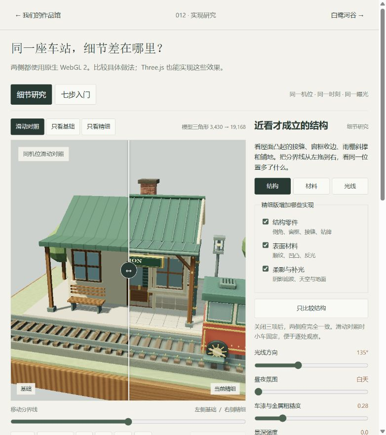
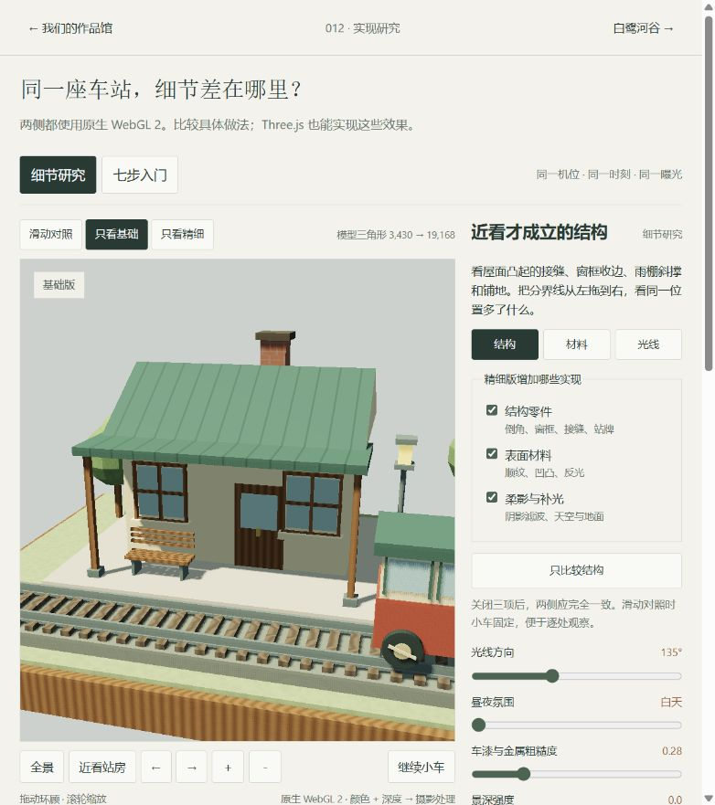
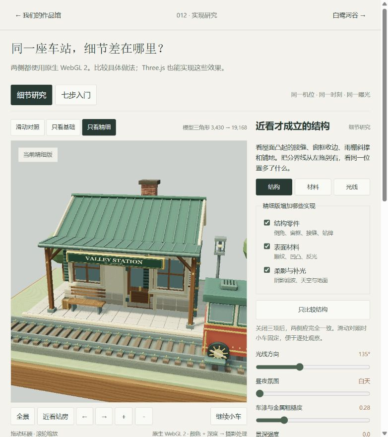
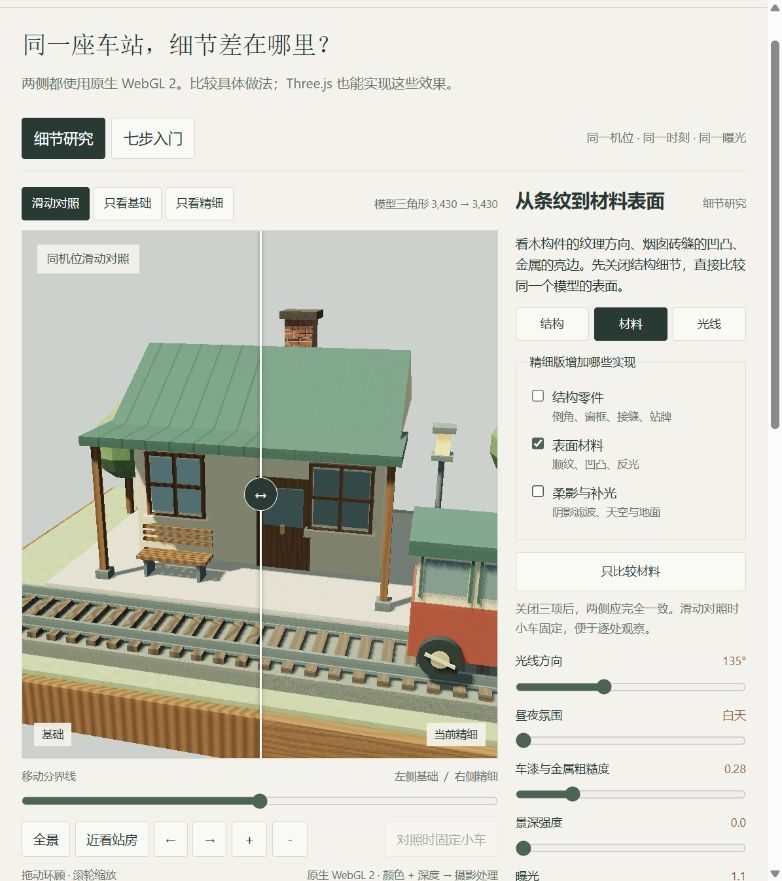

# 同一座车站：精细实现究竟多做了什么

**“看起来差不多”是合理的判断。上一版主要解释基础绘制流程；WebGL 2 本身不会让画面比 Three.js 更精致。第二版把观察对象拉近，并把结构、材料、光线拆开比较。**

[打开本地细节对照](http://127.0.0.1:8412/webgl-lab.html#detail) · [七步入门](webgl2-study.md) · [原作实景与源码分析](native-alder-analysis.md) · [返回项目](README.md)

**后续已补上[真正的 Three.js／原生 WebGL 2 技术对照](renderer-comparison.md)。** 本文左右仍是同一原生渲染器的细节开关；不要将本文图片当作两种技术的差异。第二版截图与数据保持历史记录。

研究日期：2026-09-15。参照上游 [Whistlevale，f3d769e8ea54d2f5a47d12f27773541b484c6302](https://github.com/nickfromlater/whistlevale/tree/f3d769e8ea54d2f5a47d12f27773541b484c6302)，MIT；线上部署 SHA 待核实。以下均为本仓库独立编写的教学场景，不是上游模型移植。实验未公开部署，本地服务运行时可访问。

## 1. 先按这个顺序看

1. 打开“细节研究”，在“只看基础”和“只看精细”之间切换，注意窗框、屋檐、站牌与铺地。
2. 回到“滑动对照”，拖动分界线。两侧使用同一机位、时刻、光线方向、曝光和景深，物体不会跳位置。
3. 点“结构 → 只比较结构”：材料与光线保持基础做法，观察增加真实零件的结果。
4. 点“材料 → 只比较材料”：模型数量保持不变，观察桌沿木纹方向、烟囱砖缝和金属反光。
5. 点“光线 → 只比较光线”：观察阴影边缘与背光面。最后关闭全部三项，两侧应一致。

“结构／材料／光线”按钮切换阅读重点；“只比较……”才会改变开关。滑动对照固定小车；单独观看时可以继续运行。七步入门保留在顶部第二个入口。

## 2. 效果与实现一一对应

| 观察位置 | 基础做法 | 第二版增加的实现 | 实际意义与代价 |
| :--- | :--- | :--- | :--- |
| 屋面接缝 | 在平面上画深色条纹 | 沿坡面生成细长筋条、脊盖、檐边和排水管 | 转动后仍有厚度，可以遮挡与投影；增加几何 |
| 窗框、站台石块 | 方盒与直角边 | 六个内缩面、十二条边带和八个角面组成倒角；加窗套、百叶、斜撑、铺石 | 亮边能表现边缘厚度；一个倒角盒由 12 个增至 44 个三角形 |
| 木构件与桌沿 | 主要按世界 X 坐标生成条纹 | 为每个面建立局部 UV，长边作为纹理延伸方向；叠加不同尺度变化 | 木纹随构件走向变化；每顶点增加 2 个浮点数，片元计算增加 |
| 烟囱砖缝 | 用颜色区分砖与砂浆 | 程序高度场让砂浆低于砖面，再用屏幕导数扰动法线 | 光线响应产生凹凸感；不改变真实轮廓，也没有挖出砖缝几何 |
| 金属、玻璃 | 简单高光与颜色混合 | 增加随视角变化的 Fresnel 反光和天空／地面颜色近似 | 更容易感到材质区别；没有反射实际场景，玻璃仍不透明 |
| 阴影与背光面 | 3×3 深度采样与基础环境色 | 更宽的 5×5 阴影滤波，按表面朝向混合天空与地面补光 | 阴影更柔、暗部层次更清晰；每个参与阴影计算的片元由 9 次增至 25 次采样 |
| 站牌与连接件 | 简化体块 | 生成文字纹理；补充悬挂件、门把手、铆钉、灯架、行李和小车踏板 | 告诉观看者这里是什么、怎样组装与使用；收益属于内容细节与表达 |

**这些变化没有换引擎。** 两幅画面都由同一个原生 WebGL 2 渲染器输出；“精细版”是相对于本实验基础版的名称，不代表复现了 Whistlevale 的全部品质。

## 3. 从代码到画面的具体链路

### 结构：多出来的三角形怎样起作用

`Builder.beveledBox()` 和 `Builder.beam()` 生成局部结构，`addStudyDetails()` 将它们放到站房与小车上。生成数据后，上传到 GPU 的位置、法线和索引缓冲。主画面与阴影绘制使用同一组几何，因此零件既能显示，也会进入光源深度图。

结构开关切换两组预先建立的网格，没有重新加载外部模型。当前模型量为 **3,430 → 19,168 个三角形，约 5.59 倍**，包括一座场景、一辆小车和四个轮子；这是单次模型数量，不含阴影重复绘制和全屏后处理。该实现没有索引去重或距离分级，不能据此声称最优性能。

源码：[基础几何与倒角生成](app/webgl-geometry.mjs) · [具体细节部件](app/webgl-detail-geometry.mjs)。上游可对应观察 [Nightingale 的细铆钉、车架和走台](https://github.com/nickfromlater/whistlevale/blob/f3d769e8ea54d2f5a47d12f27773541b484c6302/railway.js#L831)。

### 材料：不加几何，也能改变光照响应

局部 UV 是“这个表面上的二维坐标”。程序用它生成纹理与细微高度，再根据高度在相邻片元间的变化，修改用于光照的法线。修改的是计算中的表面朝向，真实网格仍然平整。

因此，正面看砖缝可以出现明暗凹凸，侧面轮廓仍不会凸出来；如果目标是极近距离侧看砖块，就要增加实际结构或使用其他方法。材质纹理频率、起伏幅度与观察距离也需要一起调整，不能简单把噪声调大就叫精细。

源码：[sceneFragment：程序纹理、bumpNormal、反光近似](app/webgl-shaders.mjs)。本实验光照仍是简化模型，不是完整的物理材质系统。Three.js 的 [ShaderMaterial](https://threejs.org/docs/pages/ShaderMaterial.html) 支持自定义着色器，学习这些算法可以服务现有 Three.js 项目。

### 光线：明确是什么近似

阴影深度图仍为 1024×1024；第二版增加采样范围和次数，没有提高阴影图分辨率。更宽滤波可以柔化边缘，也可能模糊过细的接触关系。天空／地面补光按法线方向计算，不会模拟光线在场景里真实反弹，也没有新增局部灯阴影。

### 对照：为什么分界线不会让模型错位

每次都用完整画布宽高比和同一状态绘制；第一遍显示基础结果，第二遍仅将右侧输出到屏幕。实现使用 [WebGL scissor](https://developer.mozilla.org/en-US/docs/Web/API/WebGLRenderingContext/scissor)，没有把相机分别塞进两个半宽窗口。

源码：[比较配置](app/webgl-comparison.mjs) · [渲染、阴影缓存与屏幕裁切](app/webgl-renderer.mjs)。切换结构时阴影缓存必须更新，否则新增零件的影子会与模型不一致。当前使用一个阴影缓冲，两种结构滑动对照时每帧都需切换重绘；这属于比较界面的额外成本。

## 4. 对我们现有作品的意义

现有作品与这个实验看起来接近，说明 Three.js 已经能够承担基础建模、光照与摄影表现。继续研究的收益，是能把“哪里不够细致”定位到具体工作：

- **近看没有厚度：**补边缘、连接与遮挡结构；先用于站房和列车等重点看点。
- **表面像统一塑料：**核对纹理方向、粗糙度、反光与起伏尺度。
- **背光面不清楚：**调整环境照明与阴影预算，再判断是否需要额外绘制。
- **有细节却看不见：**安排能观察到它的机位、尺度和光线。本轮就将被雨棚挡住的站牌移到檐下悬挂。

合适的迁移方式是把确定有效的几何与着色方法带回 003 的重点展品，继续使用已有场景组织与交互。当前未改动 003；也没有证据要求把它整体改成原生 WebGL 2。选择封装层与制作精度，是两个分别需要判断的问题。

## 5. 已执行的验证与边界

- 8 项数学／几何／比较配置测试通过，覆盖新旧网格索引、有限数值、面绕序、倒角边界和比较状态不变性。
- 现有展馆 96 项检查通过；012 构建成功，输出 73 个文件，本地 HTTP 返回内容逐项匹配构建哈希。8 份相关文档的 230 个相对文件链接、39 个静态 DOM 引用和新增模块语法检查通过。
- 浏览器实际编译、基础／精细切换、三个独立开关与“只比较”操作、昼夜、几何法线、阴影视图均已检查；分界线手柄可拖动，范围两端均正常绘制。七步入门各步画面就绪，摄影对照回到上一步正常。
- 全部细节关闭时，两份验证截图的场景取样区逐像素一致；范围与文件见[截图记录](assets/webgl-detail-v2/README.md)。这验证该固定机位取样，不代表所有设备的像素级验收。
- 浏览器检查未见 error／warn 日志。未测物理移动设备与 FPS，也未提供 Three.js 同场景性能基准。

[本轮图片清单](assets/webgl-detail-v2/image-manifest.json) · [源码版本清单](assets/webgl-detail-v2/source-manifest.json)。上一版七步截图保留在独立目录，不与新图混用。
