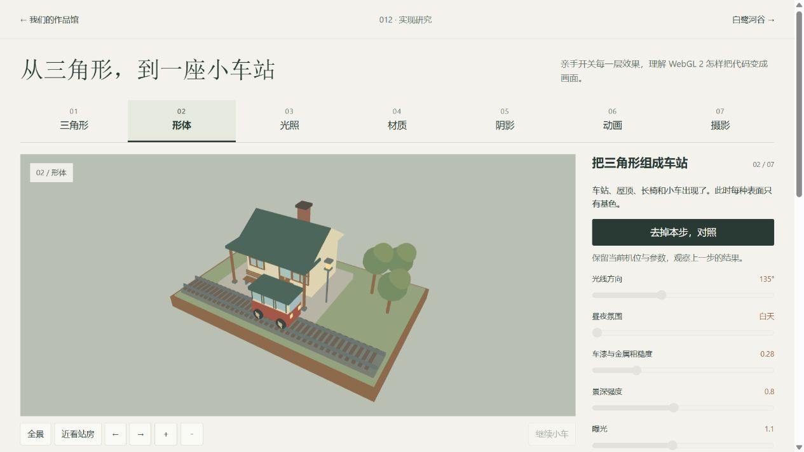
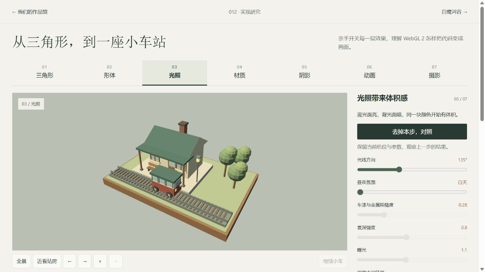
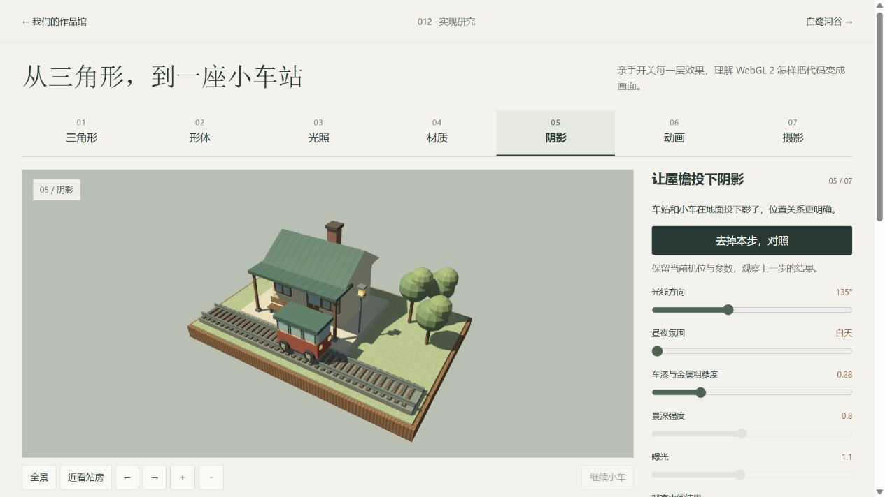
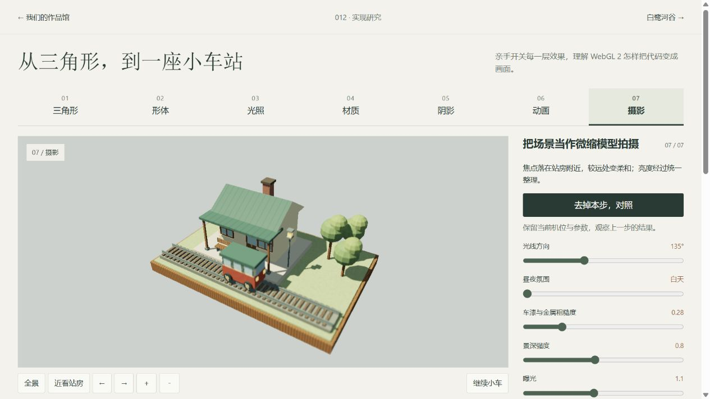
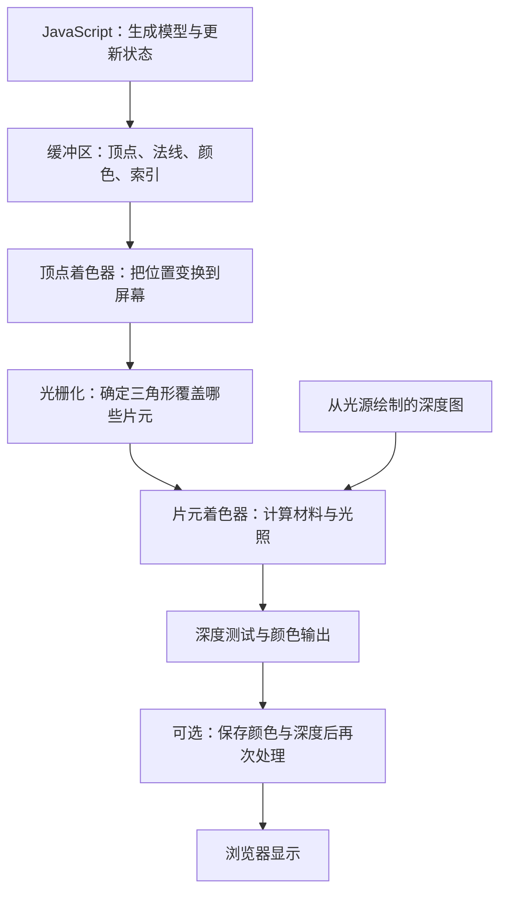
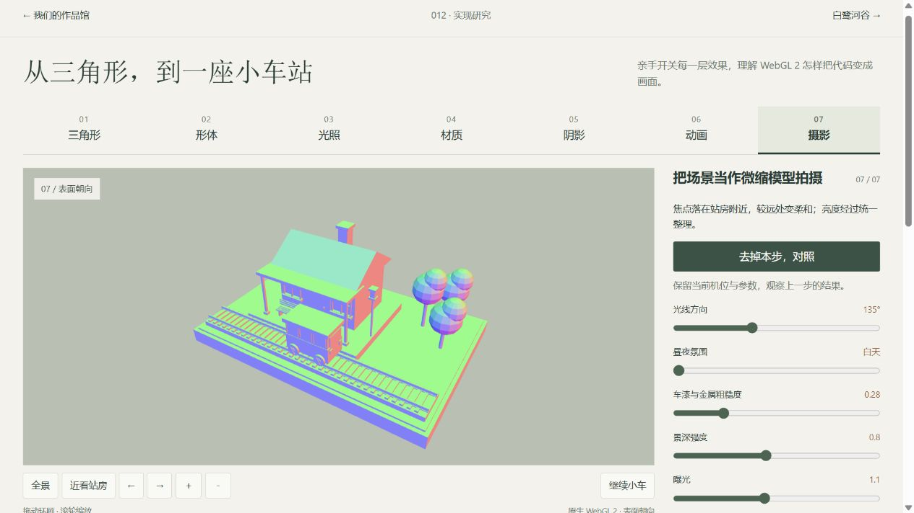
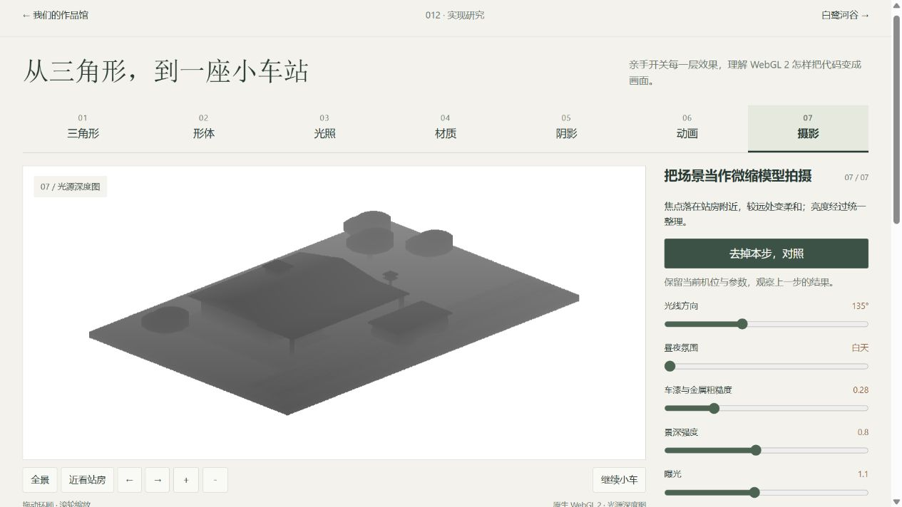

# WebGL 2：从代码到小车站

**WebGL 2 提供绘图接口；可见效果来自程序组织的几何数据、着色器、状态更新与多遍绘制。理解这一过程后，可以判断 Three.js 替我们管理了什么，也可以把 Whistlevale 的部分方法迁移到现有作品。**

[打开本地实验](http://127.0.0.1:8412/webgl-lab.html) · [从第一个三角形开始](http://127.0.0.1:8412/webgl-lab.html#step-0) · [原生作品对照](native-alder-analysis.md) · [运行说明](app/README.md) · [返回项目](README.md)

## 1. 研究范围与结论

**后续细化：**当前实验默认进入[同机位细节研究](webgl-detail-study.md)，可独立比较结构、材料与光线。本文图片与验证数字保留为第一版七步实验记录；顶部“七步入门”可继续操作原有流程。

本次以一座独立编写的小车站为教学对象，串起七个可见阶段：三角形、形体、光照、材质、阴影、动画、摄影。保持同一场景，逐步增加处理，再允许去掉本步对照。模型、材质与渲染没有导入 Three.js，也没有复制上游场景。

| 项目 | 记录 |
| :--- | :--- |
| 研究日期 | 2026-09-15 |
| 原生参照 | [Whistlevale](https://github.com/nickfromlater/whistlevale)，固定 [f3d769e8ea54d2f5a47d12f27773541b484c6302](https://github.com/nickfromlater/whistlevale/commit/f3d769e8ea54d2f5a47d12f27773541b484c6302)，2026-09-13；主仓库 MIT，保留[许可](assets/UPSTREAM-LICENSE.txt) |
| 官方接口依据 | MDN WebGL 2、着色器、绘制、光照与帧缓冲文档；Three.js 自定义材质文档，来源见末节 |
| 实验实现 | `012/app/webgl-*`，本仓库独立实现；以[源文件哈希清单](assets/webgl-lab/source-manifest.json)标识本轮版本，不虚构已提交的 commit |
| 本地与线上 | 本地 8412 端口；没有公开部署本实验。上游线上版本 SHA 仍待核实 |
| 研究深度 | 能看懂一帧的主要流程，能辨认几类效果的算法与代价；不扩展成完整引擎或图形学课程 |

三个结论：

1. **代码生成模型与实时着色是两件事。** 前者决定物体的形状，后者决定表面怎样呈现。
2. **一个最终画面可能需要多次绘制。** 阴影先从光源看一遍；景深先保存场景颜色与深度，再处理结果。
3. **直接使用 WebGL 2 的研究价值是看见底层责任。** 是否值得用它替换 Three.js，仍要由目标和实际瓶颈决定。

## 2. 先看同一个场景怎样变化



**纯色阶段：**站房、屋顶、长椅、小车和树木都是三角形组成的物体。遮挡关系已经成立，表面主要靠颜色分区。



**光照阶段：**几何没有增加。屋顶和树冠通过表面朝向产生不同亮度，出现体积感。



**材质和阴影阶段：**桌沿有程序木纹、屋面有接缝；投影加强物体与地面的关系。可以在同一机位去掉当前阶段，分辨变化来源。



**摄影阶段：**依据深度控制模糊量，再统一整理亮度。它展示摄影处理的作用，不代表原作的最终画质。

这些截图是本地实时 WebGL 2 画面。第 02—07 步保持相同几何、机位与小车位置，截图时暂停；第 01 步单独显示三角形。阶段开关属于同一程序的功能对照，启动时仍准备完整模型和着色器，不能用第一步来代表最小程序的加载体积。

## 3. 一帧画面怎样产生



### 3.1 JavaScript 准备数据

模型首先是数组。例如三角形的三个顶点各有空间坐标；车站则由许多三角形构成。程序通过 `bufferData()` 将数组送入显卡缓冲区，并告诉显卡每个顶点的字段排列。[1]

第一版每个顶点有 10 个浮点数：位置 3 个、法线 3 个、线性颜色 3 个、材料编号 1 个。当前第二版另外增加 UV 两个数，共 12 个，用于沿构件生成纹理。`Builder.box()` 等方法生成这些数据；`upload()` 建立缓冲区、索引与 VAO。VAO 记录怎样解释顶点数据，避免每次重新设置全部属性。

这里为了便于阅读和保持平面法线，每个三角形保存自己的顶点，索引没有进一步去重。它是教学取舍，不是声称最省内存的模型格式。

### 3.2 编译两类着色器

顶点着色器负责位置变换。可以把常见公式理解为：

```text
屏幕投影位置 = 投影矩阵 × 相机视图矩阵 × 物体变换矩阵 × 顶点位置
```

片元着色器负责为被三角形覆盖的片元计算输出颜色。片元与最终像素并非严格一一对应，深度测试、多重采样等还会影响最终结果。

WebGL 需要创建、填写并编译着色器，然后将它们连接成可运行程序。实验检查编译和连接结果，失败时显示原因；同一程序可用于许多次绘制。[2]

### 3.3 发出绘制命令

`drawElements()` 按索引解释数据并发起绘制。[3] 实验绘制一个静态场景网格、一个车体和四个车轮：普通场景通道合计 6 次调用；简单三角形阶段为 1 次。

帧与帧之间，小车只改变变换矩阵，静态几何不重新上传。程序只在动画、视角或参数发生变化时需要新的画面；暂停且无交互时停止持续请求动画帧，页面隐藏时也停止更新。

## 4. 效果具体来自什么算法

### 光照：比较表面与光线的方向

法线可以理解为指向表面外侧的小箭头。法线正对光源时亮，背对时暗。实验采用点积计算漫反射，再加环境光填补暗部。[4]



“表面朝向”视图直接把法线映射成 RGB。它有助于发现面朝向错误，也说明光照为什么需要形状之外的数据。实验将非均匀尺寸直接写进几何，运行时只有平移和旋转；若将来加入非均匀缩放，法线变换应改为适当的逆转置矩阵，不能直接照搬当前简化方式。

### 材质：根据位置与材料编号计算表面

木纹由坐标、噪声与正弦变化计算；屋面接缝使用周期函数；砖墙按行错位；金属与车漆通过高光参数区别。改变粗糙度时几何保持不变。

这就是程序纹理：表面变化由公式生成。它与加载图片纹理可以结合，二者不是互斥路线。实验的玻璃为不透明颜色与视角近似；材料使用简化漫反射和高光公式，不是完整物理材质系统。

### 阴影：从灯光方向先看一遍

第一遍绘制记录光源能看到的最近表面；第二遍对相机看到的表面进行深度比较。若该表面位于光源视线中已有表面之后，它就落在阴影里。帧缓冲允许把绘制结果写入纹理，供后面的通道使用。[5]



实验使用 1024×1024 深度纹理、少量深度偏移和 3×3 采样。深度偏移可以减少表面错误地遮挡自身；过大会使阴影离开物体。多次采样使边缘稍柔和，并不等于物理准确的软阴影。

本实验在灯光方向和小车位置不变时复用整张阴影图。发生变化时重新绘制 6 个对象。原作进一步区分静态环境与动态列车阴影，机制更细致。[7]

### 动画：重复使用几何，更新状态

小车按正弦函数沿直轨往返；车轮转角由位移除以半径得到。这样物体移动与轮上标记的转动有关联。这里的速度不是匀速，往返端点会减速；没有路线选择、车站停靠或轨道力学。

Whistlevale 的列车还沿轨道采样，并根据曲柄相位计算连杆与滑块；我们研究的是相同的“状态驱动变换”思路，不能把本实验叫作原作运动系统的复现。[7]

### 摄影处理：对已经画好的画面再计算

实验先保存场景颜色与深度，随后画一个覆盖全屏的三角形。片元程序根据表面离焦程度，采样附近颜色形成模糊，再进行 ACES 近似色调映射和线性颜色到 sRGB 的转换。

当前实测浏览器支持 `EXT_color_buffer_float`，使用 RGBA16F 保存超出普通显示范围的颜色。代码在不支持时退回 RGBA8，此时较亮颜色会提前截断，不能视为完全等价画质。该降级分支本轮未在不支持扩展的设备上实测。

本实验没有加入泛光、暗角、颗粒或物理镜头模拟；景深也没有解决所有遮挡边缘问题。其作用是展示多遍绘制的基本过程。[本实验着色器](app/webgl-shaders.mjs)

## 5. Three.js 封装了什么，仍要自己做什么

| 层次 | 本实验直接负责的工作 | Three.js 对应能力 | 仍需要作者决定 |
| :--- | :--- | :--- | :--- |
| 模型 | 顶点数组、属性格式、缓冲区与索引 | BufferGeometry、Mesh | 形状、比例、零件、细节 |
| 视角 | 视图、投影、物体矩阵及输入操作 | Camera、Object3D、控制器 | 看点、构图与镜头节奏 |
| 材料 | GLSL 公式、参数与程序绑定 | 内置材质、ShaderMaterial | 材料风格和自定义算法 |
| 阴影 | 深度纹理、额外通道、比较与偏移 | 灯光阴影机制 | 范围、质量、性能取舍 |
| 摄影 | 颜色和深度目标、全屏通道 | RenderTarget 与后处理组件 | 景深强度、曝光与风格 |
| 生命周期 | 释放程序、网格与纹理，处理上下文丢失 | 各类资源与渲染器接口 | 哪些对象何时创建或释放 |

Three.js 允许运行自定义 GLSL，所以“学习原生 WebGL 2”与“继续使用 Three.js”可以同时进行。[6] 本实验没有提供第二套 Three.js 画面，不作为两条路线的画质或速度基准。

## 6. 怎样读代码最有效

按这个顺序阅读，先理解职责，再看公式：

1. [webgl-lessons.mjs](app/webgl-lessons.mjs)：每一步的现象、原理、简化逻辑和上游定位。
2. [webgl-geometry.mjs](app/webgl-geometry.mjs)：一个盒体如何变成面，车站如何由部件构成。
3. [webgl-math.mjs](app/webgl-math.mjs)：相机和投影怎样改变坐标。
4. [webgl-shaders.mjs](app/webgl-shaders.mjs)：顶点、表面、阴影和摄影公式。
5. [webgl-renderer.mjs](app/webgl-renderer.mjs)：数据如何上传，几次绘制如何连接，资源如何释放。
6. [webgl-lab.mjs](app/webgl-lab.mjs)：界面、时间、相机输入与绘制更新的关系。

`webgl-lessons.mjs` 显示的短代码是简化说明，不保证单独复制即可运行。实际实现位于其对应文件，完整运行入口是 `webgl-lab.html`。

## 7. 对后续工作的意义

优先掌握三件事：

- **读得懂数据流。** 分清形状错误、法线错误、材料错误和镜头问题。
- **会做受控对照。** 保持模型、机位和状态，开关某一层处理，判断它的作用与代价。
- **会迁移一个算法。** 先把木纹或一种材料表现移到现有 Three.js 场景，验证适配方式，再考虑更复杂的后处理。

当前没有证据表明需要重写我们的整套渲染器。更合适的下一步，是保留这个小实验作为技术观察台，选择车站的一种材料或一项镜头处理，迁移到白鹭河谷，并继续用相同机位比较结果。

## 8. 来源

以下官方文档访问于 2026-09-15。MDN 页面涉及通用 WebGL 的地方，本实验采用 WebGL 2 上下文与 GLSL ES 3.00 语法，未原样复制旧教程。

1. MDN contributors. [WebGL2RenderingContext](https://developer.mozilla.org/en-US/docs/Web/API/WebGL2RenderingContext)：上下文、缓冲区、VAO、绘制能力。
2. MDN contributors. [createShader()](https://developer.mozilla.org/en-US/docs/Web/API/WebGLRenderingContext/createShader)：着色器创建与编译流程。
3. MDN contributors. [drawElements()](https://developer.mozilla.org/en-US/docs/Web/API/WebGLRenderingContext/drawElements)：按索引绘制。
4. MDN contributors. [Lighting in WebGL](https://developer.mozilla.org/en-US/docs/Web/API/WebGL_API/Tutorial/Lighting_in_WebGL)：法线与光照计算。
5. MDN contributors. [framebufferTexture2D()](https://developer.mozilla.org/en-US/docs/Web/API/WebGLRenderingContext/framebufferTexture2D)：绘制到纹理。
6. Three.js contributors. [ShaderMaterial](https://threejs.org/docs/pages/ShaderMaterial.html)：自定义着色器与参数；[WebGLRenderer](https://threejs.org/docs/pages/WebGLRenderer.html)：渲染器职责。
7. nickfromlater 与贡献者. Whistlevale 固定提交： [Builder](https://github.com/nickfromlater/whistlevale/blob/f3d769e8ea54d2f5a47d12f27773541b484c6302/railway.js#L49)、[模型](https://github.com/nickfromlater/whistlevale/blob/f3d769e8ea54d2f5a47d12f27773541b484c6302/railway.js#L838)、[材料](https://github.com/nickfromlater/whistlevale/blob/f3d769e8ea54d2f5a47d12f27773541b484c6302/railway.js#L182)、[后处理](https://github.com/nickfromlater/whistlevale/blob/f3d769e8ea54d2f5a47d12f27773541b484c6302/railway.js#L258)、[阴影与渲染](https://github.com/nickfromlater/whistlevale/blob/f3d769e8ea54d2f5a47d12f27773541b484c6302/railway.js#L485)、[机构运动](https://github.com/nickfromlater/whistlevale/blob/f3d769e8ea54d2f5a47d12f27773541b484c6302/trains.js#L298)。

本轮实际验证与未测边界记在 [notes.md](notes.md)，截图来源与文件清单见 [assets/webgl-lab](assets/webgl-lab/README.md)。
